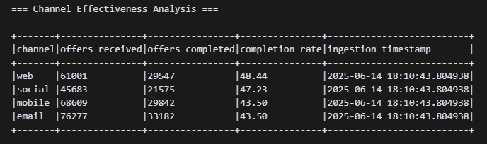
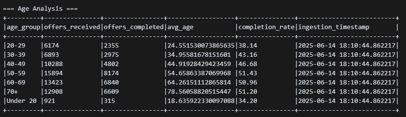
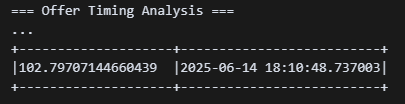

# Cafe ETL Pipeline

A robust ETL pipeline for processing cafe customer, event, and offer data using PySpark and Google Cloud Platform.

## Architecture Overview

The pipeline follows a medallion architecture pattern with four distinct layers:

1. **Landing Zone** (Raw CSV Data)
   - Initial data ingestion from source systems
   - Raw CSV storage in Google Cloud Storage
   - Source system data preservation
   - No data transformation

2. **Bronze Layer** (Raw Data)
   - Raw data ingestion with schema validation
   - Timestamp tracking for data lineage
   - Parquet format for efficient storage
   - Google Cloud Storage for data persistence

3. **Silver Layer** (Cleaned & Validated)
   - Data cleaning and standardization
   - Type casting and deduplication
   - Partitioning for query optimization
   - Data quality checks
   - BigQuery for analytical processing

4. **Gold Layer** (Business Ready)
   - Business metrics and analytics
   - Customer segmentation
   - Offer performance analysis
   - Channel effectiveness metrics
   - Age-based analytics
   - BigQuery for final data presentation

## Design Choices

### Medallion Architecture
- **Why**: Provides clear separation of concerns and data quality levels
- **Benefits**: 
  - Data lineage tracking
  - Incremental processing
  - Quality gates at each layer
  - Easy rollback capabilities

### Cloud Infrastructure (GCP)
- **Google Cloud Storage**: Cost-effective raw data storage
- **Dataproc**: Managed Spark service for ETL processing
- **BigQuery**: Serverless analytics for silver/gold layers
- **Cloud Functions**: Event-driven processing triggers

### Technology Stack
- **PySpark**: Distributed data processing
- **Python 3.8+**: Modern language features and type hints


## Project Structure

```
cafe-ETL/
├── data/                      # Data storage
│   ├── landing_zone/         # Raw CSV data from source systems
│   │   ├── customers.csv     # Customer data
│   │   ├── events.csv       # Event data
│   │   └── offers.csv       # Offer data
│   ├── bronze/              # Raw parquet data
│   │   ├── customers/       # Partitioned customer data
│   │   ├── events/         # Partitioned event data
│   │   └── offers/         # Partitioned offer data
│   ├── silver/              # Cleaned and validated data
│   │   ├── customers/       # Processed customer data
│   │   ├── events/         # Processed event data
│   │   └── offers/         # Processed offer data
│   └── gold/                # Business metrics and analytics
│       ├── customer_metrics/ # Customer analytics
│       ├── offer_metrics/   # Offer performance
│       └── daily_metrics/   # Daily aggregations
│
├── src/                      # Source code
│   ├── etl/                 # ETL processing modules
│   │   ├── __init__.py     # Package initialization
│   │   ├── bronze.py       # Bronze layer processing
│   │   ├── silver.py       # Silver layer processing
│   │   └── gold.py         # Gold layer processing
│   │
│   ├── schemas/            # Data schemas
│   │   ├── __init__.py     # Package initialization
│   │   └── data_schemas.py # Schema definitions
│   │
│   ├── utils/              # Utility functions
│   │   ├── __init__.py     # Package initialization
│   │   ├── writer.py       # Data writing utilities
│   │   └── spark_utils.py  # Spark session management
│   │
│   ├── __init__.py         # Package initialization
│   └── main.py             # Pipeline entry point
│
├── docs/                    # Documentation
│   └── architecture.drawio  # Architecture diagram
│
├── setup.py                # Package setup configuration
├── requirements.txt        # Python dependencies
├── .gitignore             # Git ignore rules
└── README.md              # Project documentation
```

### Key Components

- **Data Layers**
  - `landing_zone/`: Raw CSV data from source systems
  - `bronze/`: Raw parquet data with schema validation
  - `silver/`: Cleaned and validated data
  - `gold/`: Business metrics and analytics

- **Source Code**
  - `etl/`: ETL processing modules for each layer
  - `schemas/`: Data schema definitions
  - `utils/`: Helper functions and utilities
  - `main.py`: Pipeline orchestration

- **Documentation**
  - `docs/`: Project documentation and diagrams
  - `README.md`: Project overview and setup guide

- **Configuration**
  - `setup.py`: Package installation configuration
  - `requirements.txt`: Python dependencies
  - `.gitignore`: Version control rules

## Features

### Data Processing
- **Bronze Layer**
  - Raw data ingestion with schema validation
  - Timestamp tracking for data lineage
  - Parquet format for efficient storage
  - Error handling and logging

- **Silver Layer**
  - Data cleaning and standardization
  - Type casting and deduplication
  - Partitioning by key fields
  - Data quality validation
  - Incremental processing

- **Gold Layer**
  - **Which marketing channel is the most effective in terms of offer completion rate?**
  


  - **How is the age distribution of customers who completed offers compared to those who did not?**
  


  - **What is the average time taken by customers to complete an offer after receiving it?**

    
 

### Monitoring & Quality
- Error logging and tracking
- Data quality metrics


## Setup

1. Create and activate a virtual environment:
```bash
python3 -m venv venv
source venv/bin/activate  # On Windows: venv\Scripts\activate
```

2. Install dependencies:
```bash
pip install -r requirements.txt
pip install -e .
```

3. Create required directories:
```bash
mkdir -p data/{landing_zone,bronze,silver,gold}
mkdir -p logs
mkdir -p notebooks
```

## Usage

Run the ETL pipeline:
```bash
python src/main.py
```

## Development


### Logging
- Logs are stored in the `logs/` directory
- Timestamp-based log rotation
- Different log levels for development/production

### Code Quality
- Type hints for better code maintainability
- Automated testing with pytest
- Code formatting with black
- Linting with flake8
- Documentation with docstrings

## License

MIT